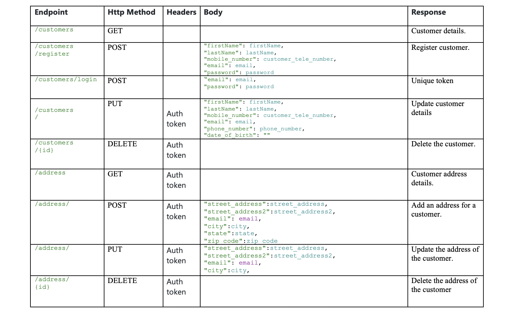

# Customer Infromation details form
*The goal of this repository is to create form to manage customer information.*


Getting Started
-----
Requirements

1.Maven 3.0+

2.IDE(Eclipse or IntelliJ)

3.JDK 11

4.spring boot 2.3.3


**Step 1: Create database**

- Create the Databse tables using Database script(db scripts folder) in MySQL database server.

- The script will create a database and tables.


- Define connection properties in /src/main/resources/application.properties

**Step 2: Build and Run the Project**


- The app will start running at http://localhost:8080.
    ```
    mvn spring-boot:run
    ```
**Step 3: Run the client application in local web server**

- open up the terminal or command prompt
- navigate to the directory where the files
- run a local python server by running:

    ```
    python3 -m http.server 1234
    ```

- Go to http://localhost:1234/login.html in your browser

**API Endpoints**




